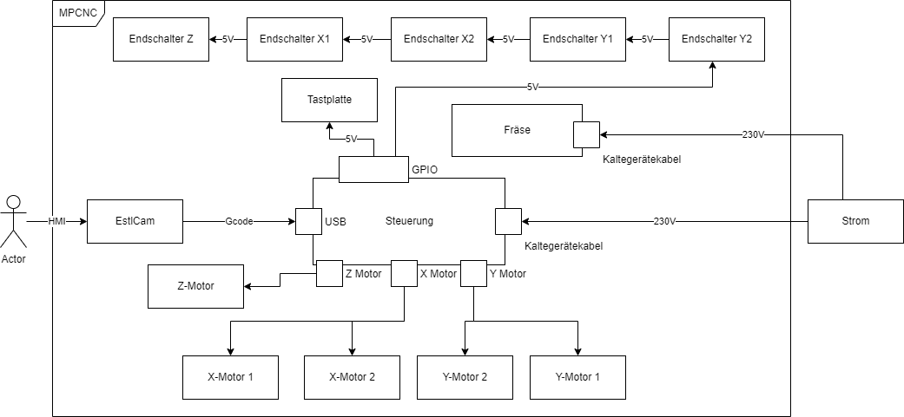

Die Dokumentationskaptiel wurden zunächst aus dem Standard Arc42 übernommen und müssen noch diskutiert werden. https://www.arc42.de/

**Inhaltsverzeichnis**

- [Einführung und Ziele](#einführung-und-ziele)
- [Randbedingungen](#randbedingungen)
- [Kontextabgrenzung](#kontextabgrenzung)
- [Lösungsstrategie](#lösungsstrategie)
  - [Bauraum](#bauraum)
- [Bausteinsicht](#bausteinsicht)
  - [Level 1 MPCNC](#level-1-mpcnc)
    - [Estlcam](#estlcam)
    - [Motoren](#motoren)
    - [Endschalter](#endschalter)
    - [Tastplatte](#tastplatte)
    - [Steuerung](#steuerung)
  - [Level 2 Steuerung](#level-2-steuerung)
  - [Level 3 CNC Shield](#level-3-cnc-shield)
    - [Pinout](#pinout)
- [Laufzeitsicht](#laufzeitsicht)
- [Verteilungssicht](#verteilungssicht)
- [Querschnittliche Konzepte](#querschnittliche-konzepte)
- [Entscheidungen](#entscheidungen)
  - [Endstops](#endstops)
  - [Ändern der Trucks](#ändern-der-trucks)
- [Qualitätsanforderungen](#qualitätsanforderungen)
  - [Frästoleranz](#frästoleranz)
  - [Mögliche Materialbearbeitung](#mögliche-materialbearbeitung)
- [Risiken](#risiken)
  - [Bauraumgröße](#bauraumgröße)
  - [Arduino Shield](#arduino-shield)
- [Glossar](#glossar)

# Einführung und Ziele
# Randbedingungen

# Kontextabgrenzung
# Lösungsstrategie

## Bauraum
Geplanter Baumraum: (X|Y|Z): 980 x 1500 x 81 mm
Tatsächlicher Baumraum: (X|Y|Z): ? x ? x ? mm

# Bausteinsicht

## Level 1 MPCNC

Die Komponentenübersicht zeigt alle im Kontext der MPCNC genutzen Komponenten und deren Schnittstellen. 

### Estlcam
Estlcam wird in der Version 11 verwendet

### Motoren
Es werden Nema 17 Motoren verwendet.

### Endschalter
Die Endschalter sind öffner und werden in reihe geschalten. 

### Tastplatte
Maße: 

### Steuerung

## Level 2 Steuerung

## Level 3 CNC Shield

### Pinout

# Laufzeitsicht
# Verteilungssicht
# Querschnittliche Konzepte

# Entscheidungen

## Endstops
Endstops als öffner hat den Vorteil, dass Kabelbrüche erkannt werden können, da in diesen Fall die Schalter immer als Ausgelöst erkannt werden. 

Die Reihenschaltung ist möglich, da Estlcam bei der Referenzfahrt in folgender Sequenz vorgeht:
 
- Einlernen der Z-Achse 
- Einlernen der X-Achse
- Einlernen der Y-Achse

Das Einlernen beinhaltet das Verfahren der Achse bis zum Endanschlag, anschließendes reversieren um einen konfigurierbaren Weg, nochmals Verfahren bis zur Achse und ein erneutes reversieren.

Das zweite Verfahren ist eine genaue Messfahrt um den Endanschlag so genau wie möglich zu ermitteln um anhand der vorherigen Messung Pulsverluste zu ermitteln.

## Ändern der Trucks
Die Trucks für die X-Achse werden anders als von der Dokumentation montiert, damit die Fräse vom Kontrollplatz aus verfolgt und so schnell wie möglich reagiert werden kann.

Durch das Ändern entsteht jedoch eine Abweichung des geplanten Bauraums. Dieser Unterschied entsteht, da der Core nicht in die Nut der Trucks fahren kann.

# Qualitätsanforderungen
## Frästoleranz
## Mögliche Materialbearbeitung

# Risiken

## Bauraumgröße

## Arduino Shield

# Glossar

